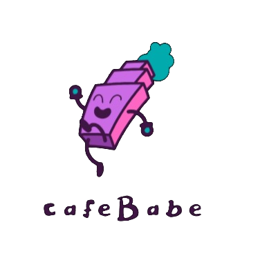

# cafeBabe🌟



**cafeBabe** is a whimsical GitHub repository that weaves a magical tale of code transformation. 🎩✨ It offers a captivating experience where Java class files are gracefully converted into mesmerizing Java Virtual Machine (JVM) instructions, all orchestrated by the mystical powers of Python! 🐍

# 🌌Table of Contents
- [Introduction](#Introduction)
- [Features](#Features)
- [Getting Started](#Getting-Started)
- [Usage](#Usage)
- [Contributing](#Contributing)
- [Reference](#Reference)
- [License](#License)


# <a name="Intoduction"></a>💡Introduction

Welcome to the fantastical world of cafeBabe! ☕️ This repository is dedicated to the art of converting Java class files to JVM instructions using the enchanting language of Python, embellished with symbols that add an extra touch of magic. 
#<a name="Features"></a>
# ✨Features

- 🧙 Magical Transformation: Watch as the Python sorcerers cast their spells, transforming Java class files into dynamic JVM instructions.
- 🎨 Symbolic Touch: The repository weaves symbols into the code, creating an ethereal language that transcends the ordinary.
- 🌈 Creative Atmosphere: Step into the enchanting ambiance of cafeBabe, where developers from all walks of life gather to witness the marvel of code metamorphosis.
- ☕️ Fuel for Creativity: The air is filled with the aroma of freshly brewed coffee, accompanied by sweet treats, ensuring your imagination never runs dry.

# <a name="Getting-Started"></a>🚀Getting Started

To begin your adventure with cafeBabe, follow these simple steps:

1. **Clone the Repository**: Start by cloning this repository to your local machine using the following command:

``` git clone https://github.com/vizzv/cafeBabe.git ```

**Install Dependencies**: Ensure you have Python installed on your system .

3. **Invoke the Magic**: Edit name of file in accessing.py file and make sure  your path is of java class file,Run the main Python script to unleash the enchantment:
``` python accessing.py ```

# <a name="Usage"></a>🎶Usage

Once cafeBabe has worked its magic on your Java class file, you'll be left with a transformed bytecode file that is now a delightful tapestry of JVM instructions. 

Feel free to explore the code and add your creative touch to the mystical dance of Java and Python. Share your experience with the community and let others be captivated by the magic of cafeBabe.

# <a name="Reference"></a>※ Reference

https://docs.oracle.com/javase/specs/jvms/se7/html/jvms-4.html

https://docs.oracle.com/javase/specs/jvms/se7/html/jvms-6.html

**Concept is stolen from video of [Tsoding Daily](https://www.youtube.com/watch?v=67FmRyv8jTM&list=PLpM-Dvs8t0VZ80zo4mwNKd9utc4vR7wUs)(btw great videos)**

# <a name="Contributing"></a>🙌Contributing

The magic of cafeBabe is not limited to a select few. We welcome contributions from all the wizards of code and the enthusiasts of creativity! If you have an idea, an improvement, or a new spell to add, please submit a pull request. Together, we can make this mystical repository even more enchanting.

# <a name="License"></a>📄License

This project is licensed under the [MIT License](LICENSE). Feel free to use and modify cafeBabe to your heart's content. Spread the magic, and remember to give credit where it's due.

---

Step into the extraordinary world of cafeBabe and witness the fusion of Java and Python like never before. Embrace the magic, and let the journey of code transformation begin! 🌌✨
